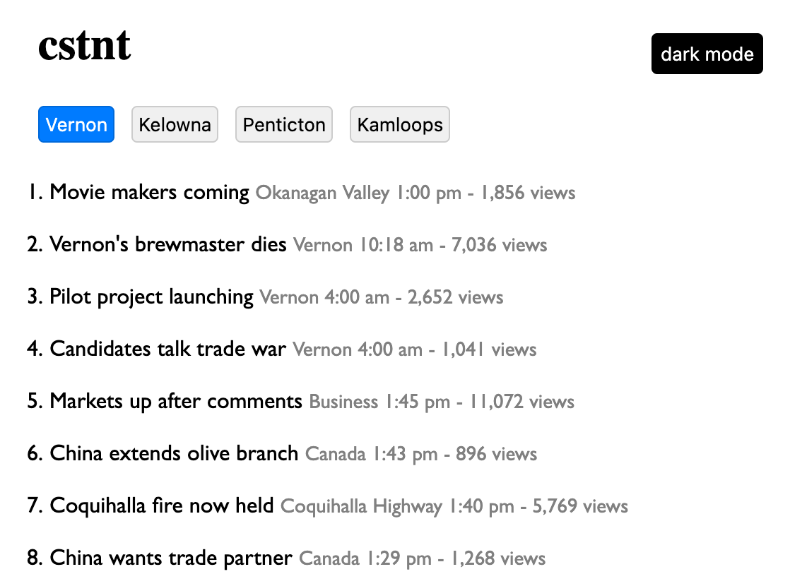

# cstnt

A simple news aggregator app built with SvelteKit.



## Features

- Display news items from multiple cities
- Dark mode toggle with preference storage
- City selection with preference storage
- Responsive design

## Development

Once you've installed dependencies with `npm install`, start a development server:

```bash
npm run dev

# or start the server and open the app in a new browser tab
npm run dev -- --open
```

## Building

To create a production version of your app:

```bash
npm run build
```

You can preview the production build with `npm run preview`.

## Testing

To run the tests:

```bash
npm run test
```
